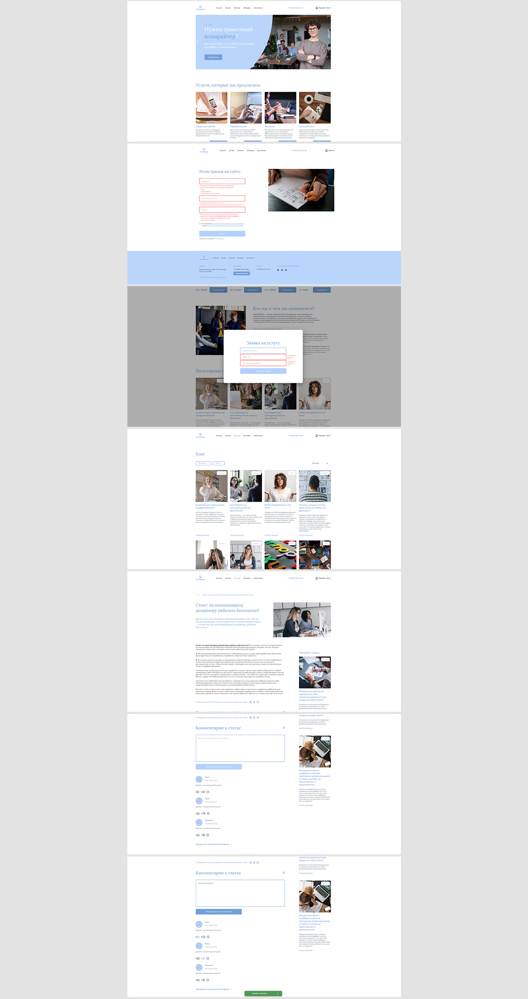

# Веб-приложение - платформа для размещения статей

Платформа для размещения и просмотра статей  
**Год:** 2022

## Внешний вид

## Реализовано:
- SPA на Angular в соответствии с техническим заданием, макетом;
- Вёрстка всех страниц и переиспользуемых компонентов;
- Реализация функционала платформы для блогов (регистрация/авторизация, отображение/просмотр/фильтрация/сортировка статей, комментирование);
- Информативная валидация всех форм;
- Реализация валидации необходимых полей приложения;
- Использование lazy-loading модулей, для оптимизации;
- Guards для разделения доступа к контенту для авторизованных и неавторизованных пользователей;
- Interceptor для удобства работы с jwt-токенами;
- Тестирование компонентов и сервисов с помощью Jasmine/Karma.

## Возможности:
* Регистрация, авторизация пользователя;
* Оставление заявки на услугу;
* Просмотр статей, их фильтрация по тегам;
* Пагинация;
* Комментирование статей (для авторизованного пользователя);
* Оставление реакций и жалоб на комментарии (для авторизованного пользователя).

## Используемые технологии:
* Angular (HTML, SCSS, TypeScript)
* Angular Material
* RxJS
* ESLint
* Jasmine
* Karma
* JWT-Авторизация
* MongoDB
* Доп. библиотеки (ngx-owl-carousel, ngx-mask)
* Postman
* Swagger